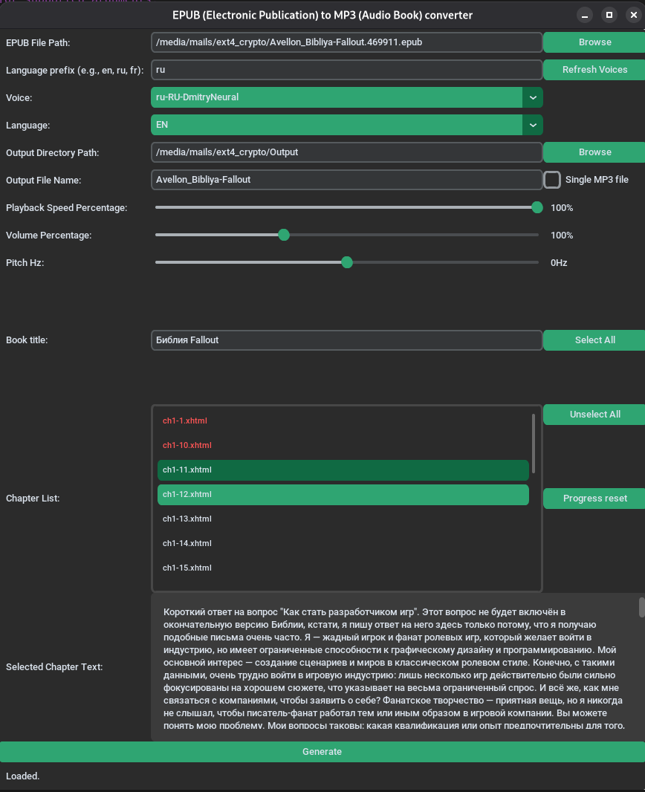

# EPUB to MP3 Audio Book Converter


## Overview

A Python application that converts EPUB files to MP3 audiobooks using Microsoft Edge TTS (Text-to-Speech) voices.



## Features

- Convert EPUB files to MP3 audiobooks
- Select EPUB file using a file dialog
- Choose from various Microsoft Edge TTS voices
- Adjustable playback settings (speed, volume, pitch)
- Generate MP3 file per chapter or single file for entire book
- Multi-language support (EN, RU)
- Save/load UI state between sessions
- Progress tracking for chapters

## Requirements

- Python 3.8+
- Microsoft Edge (for TTS voices on Windows)
- Internet connection (required for TTS)

## Installation

```bash
# Clone the repository
git clone https://github.com/kivinblue1/EpubToAudioBookConverter
cd EpubToAudioBookConverter

# Create virtual environment
python -m venv .venv
source .venv/bin/activate  # Linux/Mac
# or
.venv\Scripts\activate  # Windows

# Install dependencies
pip install -r requirements.txt

# Install edge-tts (if not in requirements)
pip install edge-tts
```

## Usage

```bash
python src/epub_to_mp3_converter.py
```

## Configuration

The application saves UI state to `ui_status.json` including:
- Last used EPUB file path
- Voice selection
- Output directory and filename
- Playback settings (speed, volume, pitch)
- Window geometry

## Dependencies

- customtkinter - Modern Tkinter GUI
- edge-tts - Microsoft Edge Text-to-Speech
- EbookLib - EPUB parsing
- beautifulsoup4 - HTML parsing
- CTkListbox - Custom listbox widget

## License

MIT License - See `license` file for details.

## Author

Created as a learning project for customtkinter.
